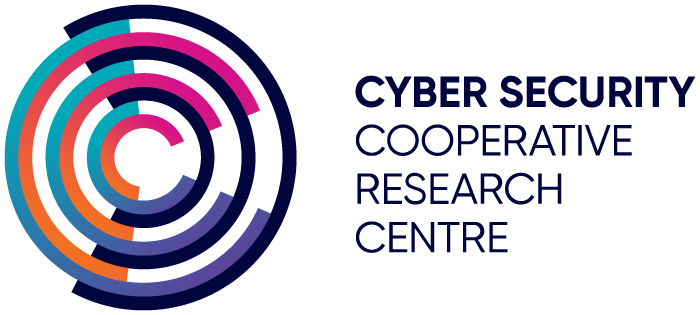

# &nbsp;

# Cyber Deception Research Lab

The UNSW Sydney Cyber Deception Research Lab is a multidisciplinary research group investigating the construction, use and impact of deception. Themes include Machine Learning to create and detect deceptions, metrics and measurements of effectiveness, and perception and cognitive aspects.

Launched in early 2020 with support from the [Cyber Security CRC](https://www.cybersecuritycrc.org.au/) and [Penten](https://www.penten.com), our current focus is deceptive content creation. We have a number of projects that learn models of real world elements of the IT stack and generate realistic fakes, including documents, databases, audio and network traffic.

# People

|| &nbsp; &nbsp; &nbsp; &nbsp; &nbsp; &nbsp;  &nbsp; &nbsp; &nbsp; &nbsp; &nbsp; &nbsp;  &nbsp; &nbsp; &nbsp; &nbsp; &nbsp; &nbsp; |
|---|---|
|[Dr David Liebowitz](https://www.linkedin.com/in/david-liebowitz)|&nbsp;&nbsp; &nbsp; &nbsp; &nbsp;  |

&nbsp;

## Collaborators

||||
|---|---|---|
|[Prof Salil Kanhere, UNSW](https://salilkanhere.net)|[Dr Kristen Moore, Data61](https://www.linkedin.com/in/kristenlmoore/)|[Dr Surya Nepal, Data61](https://research.csiro.au/distributed-systems-security/people/staff/)|

&nbsp;

## PhD Students

|||
|---|---|
|[David Nguyen](https://www.linkedin.com/in/david-d-nguyen-b70b4a1a4/)|[Roelien Timmer](https://www.linkedin.com/in/roelien-christien-timmer-4484395b/)|

&nbsp;
  
## Masters Students

|||
|---|---|
|[Michael Longland](https://www.linkedin.com/in/michael-longland-58a12b12a/)|Keerth Rathakumar|

&nbsp;
 
## Past Members

|||||
|---|---|---|---|
|[Alexander Bunn](https://www.linkedin.com/in/alexander-bunn/)|[Dr Cody Christopher](https://www.linkedin.com/in/cjchristopher/)|Ricard Grace|[Adam Green](https://www.linkedin.com/in/adam-green-5b8238172/)|

 &nbsp;

# Publications

- Kristen Moore, Cody James Christopher, David Liebowitz, Surya Nepal and Renee Selvey. _Modelling direct messaging networks with multiple recipients for cyber deception_. In IEEE European Symposium on Security and Privacy, EuroS&P 2022, Genoa, Italy, June 6-10, 2022. IEEE, 2022 and [arXiv](https://arxiv.org/abs/2111.11932).
-	David Liebowitz, Surya Nepal, Kristen Moore, Cody Christopher, Salil Kanhere, David Nguyen, Roelien Timmer, Michael Longland and Keerth Rathakumar. _Deception for Cyber Defence: Challenges and Opportunities._ In 2021 Third IEEE International Conference on Trust, Privacy and Security in Intelligent Systems and Applications (TPS-ISA) 2021 Dec 13 (pp. 173-182) and [arXiv](https://arxiv.org/abs/2208.07127).
-	Cody Christopher, Kristen Moore and David Liebowitz, _SchemaDB: Structures in Relational Datasets_,  Proceedings of the Twentieth Australasian Data Mining Conference (AusDM 2022) and [arXiv](https://arxiv.org/abs/2111.12835).
-	Roelien Timmer, David Liebowitz, Surya Nepal and Salil Kanhere. _Can pre-trained Transformers be used in detecting complex sensitive sentences?-A Monsanto case study._ In 2021 Third IEEE International Conference on Trust, Privacy and Security in Intelligent Systems and Applications (TPS-ISA) 2021 Dec 13 (pp. 90-97). IEEE and [arxiv](https://arxiv.org/abs/2203.06793).
-	Roelien Timmer, David Liebowitz, Surya Nepal and Salil Kanhere. _TSM: Measuring the Enticement of Honeyfiles with Natural Language Processing_, Proceedings of the 55th Hawaii International Conference on System Sciences. 2022 and [arXiv](https://arxiv.org/abs/2203.07580).
-	David Nguyen, David Liebowitz, Surya Nepal and Salil Kanhere. [_HoneyCode: Automating Deceptive Software Repositories with Deep Generative Models_](https://scholarspace.manoa.hawaii.edu/server/api/core/bitstreams/986b6770-2027-4a7c-8a13-b80808a192db/content), Proceedings of the 54th Hawaii International Conference on System Sciences. 2021.

 &nbsp;

# Presentations

&nbsp;

David Liebowitz at ACISP 21 on Machine Learning for Cyber Deception

<iframe width="560" height="315" src="https://www.youtube.com/embed/ki1JuflwD-A" title="YouTube video player" frameborder="0" allow="accelerometer; autoplay; clipboard-write; encrypted-media; gyroscope; picture-in-picture" allowfullscreen></iframe>

&nbsp; 

David Nguyen on HoneyCode

<iframe title="David Nguyen on Generation of Synthetic Software Repositories, 11 June 2020" width="580" height="326" src="https://www.youtube.com/embed/wnj_FqFZNe8?feature=oembed" frameborder="0" allow="accelerometer; autoplay; encrypted-media; gyroscope; picture-in-picture" allowfullscreen></iframe>

 &nbsp; 

Aditya Shinde and Prashant Doshi from the THINC Lab at the University of Georgia. Aditya presents their work on Active cyber deception for attacker intent recognition using factored interactive POMDPs.

<iframe title="Aditya Shind on Active cyber deception for attacker intent recognition using factored interactive POMDPs, 12 August 2020" width="580" height="326" src="https://www.youtube.com/embed/lsWOKOcKPFM?feature=oembed" frameborder="0" allow="accelerometer; autoplay; encrypted-media; gyroscope; picture-in-picture" allowfullscreen></iframe>

&nbsp;

# Partners

The Cybersecurity Cooperative Research Centre is dedicated to fostering the next generation of Australian cyber security talent, developing innovative projects to strengthen our nation's security capabilities. We build effective collaborations between industry, government and researchers, creating real-world solutions for pressing cyber-related problems. We achieve this by identifying, funding and supporting research projects that build Australia's cyber security capacity and address issues across the cyber spectrum, both technology and policy related. The CSCRC also undertakes a key public role in cyber security advocacy, providing evidence-based commentary around relevant cyber security issue

 
Penten is a Canberra based, cyber company focused on innovation in secure mobility and applied artificial intelligence (AI). Penten's AltoCrypt family of secure mobility solutions enable mobile secure access to classified information for government. This access provides government workers with the accessibility and flexibility of a modern workplace. Penten's Applied AI business unit creates realistic decoys using a novel combination of machine learning and artificial intelligence to detect and track sophisticated cyber adversaries. In 2018, Penten won Telstra Australian Business of the Year. In 2019, Penten was awarded Cyber Business of the Year at the Australian Defence Industry Awards; Most Innovative Company, Government sector at the AFR and Boss awards and Most Innovative Platform at the AFR and Boss Awards. Penten also ranks in the Top 20 of Australian Defence Magazines ANZ SME list.
